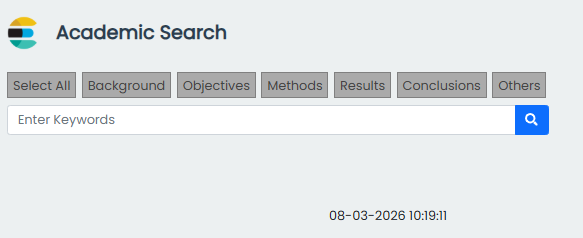
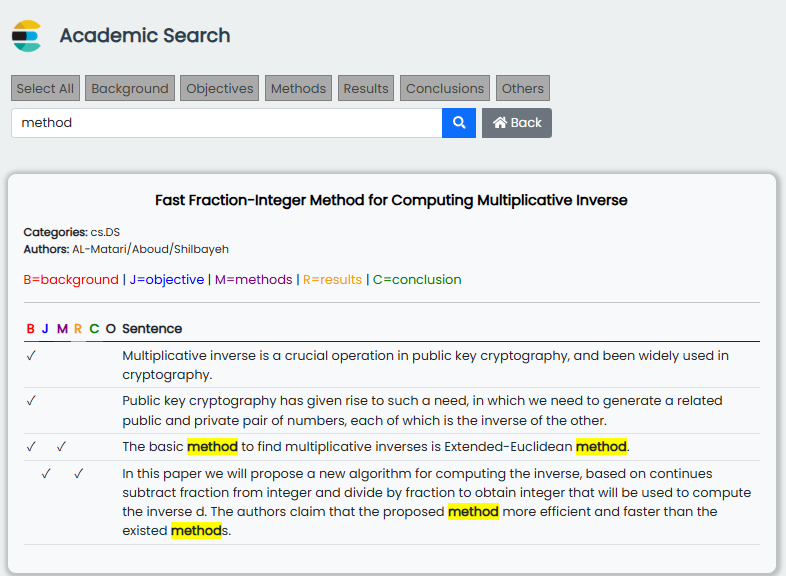
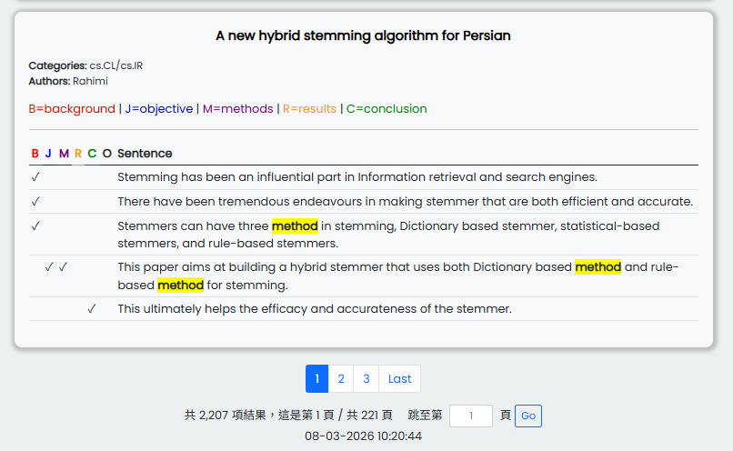

# Academic Search Engine (學術資料檢索系統)

本專案實作一個基於 Docker 與 Elasticsearch 的全文檢索系統，支援 20,000+ 筆論文資料的高效搜尋、學術分類篩選與響應式展示。目前已成功部署於 **Oracle Cloud Infrastructure (OCI)**。

## 🌐 部署資訊 (Deployment)
* **環境**: Oracle Cloud (OCI) - Ashburn Region
* **規格**: ARM-based Ampere A1 Compute (4 OCPU / 24GB RAM)
* **架構**: 完全容器化部署 (Docker-compose)

## 🛠 技術棧 (Tech Stack)
* **搜尋引擎**: Elasticsearch 7.10 (處理全文索引、關鍵字高亮與分頁)
* **後端邏輯**: PHP 7.4-FPM + Elasticsearch PHP Client (官方 SDK)
* **網頁伺服器**: Nginx (反向代理與 FastCGI 轉發)
* **前端介面**: Bootstrap 5 + RWD (針對行動裝置優化之響應式設計)
* **容器化技術**: Docker & Docker-compose (服務解耦與快速遷移)

## 💡 核心功能
* **全文檢索**: 透過 Elasticsearch RESTful API 實作標題、作者及內容的高效檢索。
* **學術標記系統**: 自動比對並標示 Background, Methods, Results, Conclusions 等學術分類。
* **UI/UX 優化**: 
    * **關鍵字高亮**: 搜尋結果精準黃底標色。
    * **高效分頁控制**: 支援大數據量翻頁及「直接跳轉頁碼」功能。
    * **RWD 手機適配**: 手機端自動將表格轉化為卡片流，解決窄螢幕閱讀痛點。
* **狀態維持**: 利用 Cookie 實作跨頁搜尋條件記憶，優化使用者翻頁體驗。

## 📸 系統界面展示 (System Interface)

### (1) 搜尋首頁

### (2) 全文檢索與結果高亮

### (3) 分頁與跳轉功能

## 📂 目錄結構
* `html/html/search.php`: 核心搜尋 logic 與前端渲染。
* `docker-compose.yml`: 定義容器間的網路連結、硬體資源限制與磁碟掛載。
* `nginx.conf`: Nginx 路由規則與安全性配置。

## 🚀 維運與優化
* **JVM 調優**: 針對 Elasticsearch 於 OCI 環境的記憶體佔用進行 JVM 堆大小優化。
* **安全控管**: 實作 OCI VCN 安全列表 (Security Lists) 與防火牆策略。
* **自動化維運**: 透過 Docker 重啟機制確保服務穩定性。
